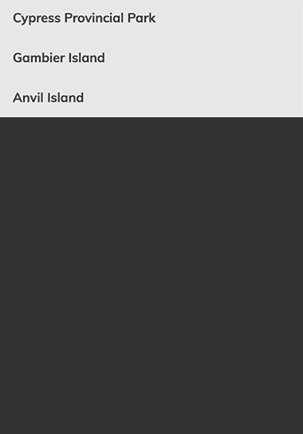

## MATTHEW ISRAELSONS SUBMISSION

### TASKS 1, 2 & 3 IMPLEMENTED

## Setup

The software was tested using v8.11.2 of NodeJS.

Installation:

1. Please **do not** fork this repository to your own github profile
2. Clone the repository to your machine
3. Run `npm install` to add dependencies from package.json
4. Setup .env file with a mapbox key. See the section on environment variables
4. Run `npm run dev:client` to start webpack-dev-server
5. Run `npm run dev:api` to start the express api
6. In your browser navigate to `http://localhost:3000` 

> The webpack-dev-server will proxy requests that start with `/api` to port 3001.


### Environment Variables

The following environment variables are needed for the project. You can create a `.env` file in the root of the projects. We use [dotenv](https://github.com/motdotla/dotenv) to load the configuration.

```
MAPBOX_PUBLIC_KEY=<create this using your mapbox account>
DATABASE_URL=postgres://user@localhost:5432/<databasename>
```

The `DATABASE_URL` is only needed if you want to work on the __API & Database__ feature.


## Submission

While you are implementing the features ensure that you are making commits at a natural pace. Once you are happy with your work please add the repo to your own github under a different repository name. We are avoiding a fork because we would prefer if candidates aren't able to easily see each other's work.

Please submit a link through email to your new github repo, include any information you think would help us in the evaluation process. 


## Building Features

There are a few features that we would like to add to this application. It is not expected that you build all of these features. Ideally you will choose two or three to implement. 

The four options are:

1. React Component
2. Mapbox GL Integration
3. Charting Data
4. API & Database

In the docs folder [app.m4v](docs/app.m4v) shows what the product would like once these feature are completed.

## React Component

Build a two level accordion menu to allow the user to select which site they would like to view data for. 




### Requirements

- When the component loads it displays the top level items.
- When a top level item is selected then a sub menu will appear.
- When a subitem is selected then it will dispatch an action `centerMapOnSite` with the appropriate site id.
- This component should be made from scratch, no component libraries.


## Mapbox GL Integration

We currently show the bounding box for the currently selected site. We would also like to do a fill within the bounds of the box. This provides a bit of contrast against the sattelite images. Once this is done we would also like to represent the location of trees on the site using circles.


### Requirements

- Add a layer that can fill the site bounding box with a slightly transparent colour.
- The redux store doesn't contain trees, so that will need to be hooked up to the api.
- Add a layer that can draw the positions of the trees using circles.


### Stretch

- Use mapbox paint feature to represent the trees heights with different colour values. Trees that have a height of 0 meters should be `white`. Trees that have a height of 70m should be `darkgreen`. Everything in between is a gradient between these two values. See example screenshot.


## Charting Data

We are interested in knowing what our distribution of tree size is. We could chart this information. Create a bar chart that divides the trees into ranges. Each bar should represent the number of trees that fit into each range.


### Requirements

-  Use the ranges 0m - 10m, 10m - 20m, 20m - 30m, 30m - 40m, 50m - 60m, 60m - 70m.
-  Match the screenshot layout as closely as possible.


## API & Database

We currently serve hardcoded JSON data from our API. We would like the routes to make database queries to retrieve the most up to date data.


### Setup

> PostgreSQL v10.4 was used for the reference implementation.

You will need to add the required environment variable for the `DATABASE_URL`. Once you can connect to the db you will want to run the migration and seeds. 

- To migrate the db run `npm run migrate`
- To seed the db run `npm run seed`

This should fill the db with projects, sites and trees.


### Requirements

- The data must be returned in the same format and structure that exists in the JSON documents. The client code must be unaware that the source of the data has changed.
- The `db` object that is currently being passed into the routes is empty. Switch this to `require('./db')` instead so that the routes can use the db to do the queries.


## References

The following documentation was used to create the reference implementation.

- https://reactjs.org/
- https://redux.js.org/
- https://github.com/reduxjs/reselect/
- https://www.mapbox.com/mapbox-gl-js/api/
- https://www.mapbox.com/mapbox-gl-js/examples/
- http://turfjs.org/
- https://vx-demo.now.sh/docs/
- https://www.postgresql.org/docs/10/static/index.html
- https://expressjs.com/
